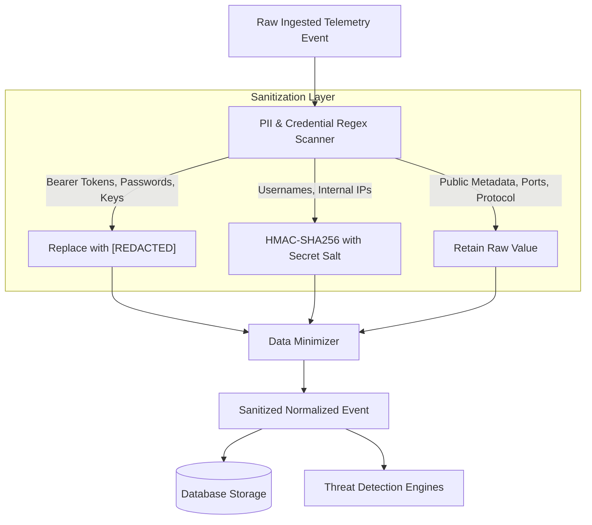

# Privacy Engineering Specification

## 1. Privacy Principles & Philosophy

The primary objective of **Privacy-Preserving Threat Detection** is to decouple threat intelligence and collaborative anomaly detection from the exposure of sensitive identities and proprietary network topology.

Traditional Security Information and Event Management (SIEM) systems ingest raw packet captures, user credentials, email addresses, and full IP topology into centralized repositories, creating high-value targets for adversaries. This platform enforces **Privacy by Design** through four defensive tiers:

1. **Data Minimization**: Ingesting only network flow metrics necessary for classification.
2. **Deterministic Pseudonymization**: Transforming identifiable network nodes into salted hashes.
3. **Sensitive Field Redaction**: Stripping credentials, tokens, and authorization headers at the network edge.
4. **Decentralized Model Training**: Ensuring raw local training data never leaves participating edge environments.

---

## 2. Technical Privacy Controls



### 2.1 PII Detection & Credential Redaction
All incoming JSON payloads are recursively evaluated by a pattern matching engine before any downstream processing:
- **Authorization & Tokens**: Regex scanning catches HTTP `Bearer`, `Basic`, `Token`, AWS access keys (`AKIA[0-9A-Z]{16}`), and SSH/PGP private keys. Matches are irreversibly masked with `[REDACTED]`.
- **Emails & Usernames**: RFC 5322 compliant regex identifies email addresses. Usernames and account identifiers are quarantined for pseudonymization.
- **Credit Cards & Social Identifiers**: Standard Luhn patterns and regex masks prevent accidental leakage of payment or national identifier strings.

### 2.2 Salted HMAC-SHA256 Pseudonymization
To allow the detection engine to correlate repetitive attack behavior without exposing raw network architecture:
- **Algorithm**:
  $$\text{Pseudonym} = \text{Prefix} + \text{HexSubstring}\left(\text{HMAC-SHA256}(\text{Identifier}, \text{Salt}), 6\right)$$
- **Salt Management**:
  - The secret salt is loaded via the secure environment variable `PSEUDONYM_SALT`.
  - Salts are never committed to version control or persisted alongside pseudonymized logs.
- **Prefix Conventions**:
  - Internal IP Addresses $\rightarrow$ `IP-XXXXXX` (e.g., `192.168.1.105` $\rightarrow$ `IP-3F9A1B`)
  - Usernames / Emails $\rightarrow$ `USER-XXXXXX` (e.g., `operator@threatguard.internal` $\rightarrow$ `USER-7F31A9`)

### 2.3 Data Minimization
Unnecessary telemetry fields, client environment variables, extraneous HTTP headers, and operating system build numbers are purged prior to normalization.

---

## 3. Decentralized Federated Learning Privacy

```
+-------------------------------------------------------------+
| CLIENT 1 PRIVATE CLUSTER                                     |
|  - Raw Flow Telemetry (Kept strictly on-premises)           |
|  - Local Gradient / Tree Weights Calculated                 |
|  - Differential Privacy L2 Clipping Applied                 |
+-------------------------------------------------------------+
                               |
                               | Model Weights (ΔW1, N1)
                               v
+-------------------------------------------------------------+
| CENTRAL FEDERATED SERVER                                    |
|  - Receives only parameter matrices (NO RAW RECORDS)        |
|  - FedAvg Weighted Sample Aggregation                       |
|  - Evaluates Global Metric Performance                      |
+-------------------------------------------------------------+
```

1. **Zero Raw Data Egress**: Participating clients keep 100% of their packet captures, netflow records, and local event histories within their boundary.
2. **Model Parameter Clipping**: Model updates from individual clients are subjected to $L_2$ norm bounding ($\|W\|_2 \le C$) to prevent training set reconstruction attacks and malicious model poisoning.
3. **Differential Privacy (DP)**: Support for adding calibrated Gaussian noise to the aggregated parameters ensures that no individual transaction or edge record can be reconstructed from the global weights.

---

## 4. Privacy Audit Trail

Every modification, pseudonymization, or redaction event generates an immutable record in the `privacy_events` table:
- `timestamp`: RFC 3339 timestamp of transformation
- `event_id`: Foreign key reference to the ingested telemetry event
- `field_name`: The field subjected to transformation (e.g., `source`, `auth_user`)
- `action_type`: `REDACTED` or `PSEUDONYMIZED`
- `rule_triggered`: Identification of the regex or policy pattern that flagged the field

---

## 5. Technical Control Mapping

| Privacy Category | Technical Mechanism | Platform Implementation |
| :--- | :--- | :--- |
| **Data Minimization** | Attribute filtering | Ingestion validator removes non-essential headers |
| **Pseudonymization** | Salted HMAC-SHA256 | Identity & IP masking in `backend/app/services/privacy_service.py` |
| **Confidentiality** | In-flight & At-Rest Encryption | TLS-ready ASGI server + encrypted PostgreSQL tables |
| **Decentralized ML** | Federated Averaging (FedAvg) | Flower-compatible server/client in `backend/app/federated/` |
| **Accountability** | Immutable Audit Trail | Append-only audit logger in `backend/app/services/audit_service.py` |

> [!NOTE]
> **Important Disclaimer**: The mappings above represent **technical security and privacy controls**. They do not constitute a formal legal certification of compliance under GDPR, HIPAA, or CCPA. Organizations must perform independent regulatory assessments.

---

## 6. System Limitations & Boundaries

To adhere strictly to engineering rigor, the following limitations are explicitly documented:
1. **Regex Completeness**: Pattern-based PII detection cannot guarantee 100% detection of obfuscated or non-standard identifiers (e.g., base64 encoded strings or binary protocol payloads).
2. **Cryptographic Re-identification**: Pseudonymization is reversible if an adversary obtains unauthorized access to both the raw database and the secret `PSEUDONYM_SALT`. Salts must be securely rotated according to organization key management policy.
3. **Side-Channel & Frequency Attacks**: While individual IP addresses are pseudonymized, persistent traffic volume patterns from a single pseudonymized entity could theoretically be correlated by an advanced adversary observing both endpoints.
