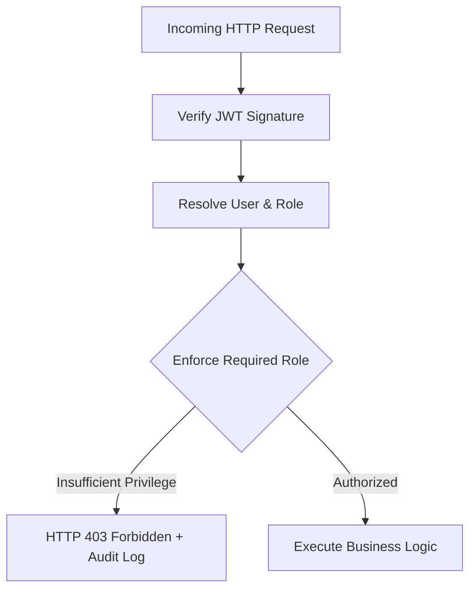

# Security Architecture & Hardening Guide

## 1. Threat Model

The platform is designed against the following adversary profiles and threat vectors:

| Threat Vector | Potential Impact | Mitigating Architecture |
| :--- | :--- | :--- |
| **Eavesdropping on Telemetry** | Interception of sensitive corporate telemetry | Enforced TLS transport + Client API Key validation |
| **Model Poisoning (FL)** | Adversary corrupts edge model updates to evade detection | Differential Privacy $L_2$ gradient clipping + update validation |
| **Data Exfiltration via Logs** | PII / Credentials exposed in security logs | In-line PII redaction and HMAC-SHA256 pseudonymization |
| **Unauthorized API Access** | Malicious users acknowledge alerts or cancel training | Role-Based Access Control (RBAC) + JWT signature verification |
| **Denial of Service (DoS)** | Event flooding crashes the ingestion broker | Asynchronous event queues + sliding-window rate limiters |
| **SQL Injection & XSS** | Database compromise or session hijacking | Parameterized SQLAlchemy queries + React contextual auto-escaping |

---

## 2. Authentication & Credential Security

### 2.1 Native Bcrypt Hashing
- User passwords are never persisted in plaintext.
- Hashing is performed using native `bcrypt` with automatic 72-byte boundary handling to prevent denial-of-service or truncation attacks:
  ```python
  salt = bcrypt.gensalt(rounds=12)
  hashed_pw = bcrypt.hashpw(password.encode("utf-8")[:72], salt)
  ```

### 2.2 JSON Web Tokens (JWT)
- Access tokens are signed using `HS256` or `RS256` with a high-entropy secret key (`JWT_SECRET`).
- Tokens include explicit expiration timestamps (`exp`, default 60 minutes) and issuer boundaries.
- Frontend stores tokens in secure, memory-managed session storage or `HttpOnly` cookies.

---

## 3. Role-Based Access Control (RBAC)

Authorization is strictly verified in backend route dependencies before any database or business logic executes. Frontend route guards are treated as usability conveniences, never as security boundaries.



### Permission Matrix
| Endpoint / Resource | Required Role |
| :--- | :--- |
| Start/Stop Federated Training | `ADMIN` |
| Promote/Rollback Global Models | `ADMIN` |
| Register Telemetry Client | `ADMIN` |
| Ingest Telemetry (`/api/events`) | `CLIENT`, `ADMIN` |
| Acknowledge / Resolve Alerts | `SECURITY_ANALYST`, `ADMIN` |
| View Audit Logs | `SECURITY_ANALYST`, `ADMIN` |
| View System Metrics & Status | `VIEWER`, `SECURITY_ANALYST`, `ADMIN` |

---

## 4. HTTP Security Headers

The backend applies defensive HTTP security headers via ASGI middleware on all responses:

```http
Content-Security-Policy: default-src 'self'; script-src 'self'; style-src 'self' 'unsafe-inline'; img-src 'self' data: https:; connect-src 'self' ws: wss:;
Strict-Transport-Security: max-age=31536000; includeSubDomains; preload
X-Content-Type-Options: nosniff
X-Frame-Options: DENY
X-XSS-Protection: 1; mode=block
Referrer-Policy: strict-origin-when-cross-origin
Permissions-Policy: geolocation=(), microphone=(), camera=()
```

---

## 5. Application Security & Vulnerability Mitigations

### 5.1 SQL Injection Protection
All database operations utilize SQLAlchemy ORM with async drivers (`asyncpg` / `aiosqlite`). Raw SQL query concatenation is strictly forbidden across the codebase; all parameters are bound via prepared statements.

### 5.2 Cross-Site Scripting (XSS) Mitigation
- The Next.js / React frontend automatically escapes interpolated variables in JSX.
- No `dangerouslySetInnerHTML` blocks are used for rendering untrusted security telemetry or alert notes.

### 5.3 Input Validation
Every API endpoint validates incoming JSON payloads using strict Pydantic v2 schemas:
- Explicit type coercion
- Maximum length constraints on text fields
- Numeric bounds checking on telemetry metrics (e.g. port range `1 - 65535`)
- Unknown or extraneous fields are stripped or rejected.

### 5.4 Audit Logging
Every security-relevant operation creates an append-only audit event in the `audit_logs` table. Audit logs record:
- Exact UTC timestamp
- Actor ID and IP address
- Action name (e.g., `LOGIN`, `ALERT_ACKNOWLEDGED`, `MODEL_PROMOTED`)
- Target resource and identifier
- Operation outcome (`SUCCESS`, `FAILURE`, `DENIED`)
